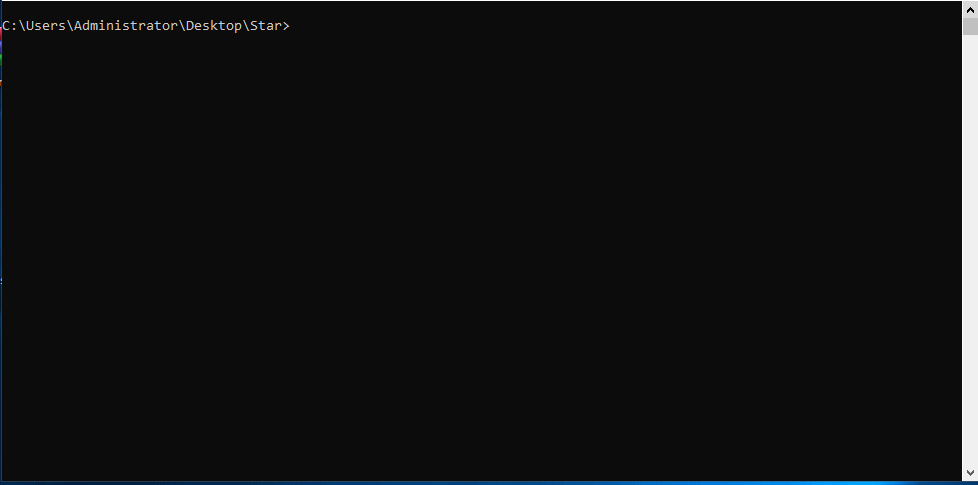

# starpatterns

`starpatterns` is a lightweight Python library for generating ASCII patterns, fractals, and **۲۰+** ترمینال انیمیشن جذاب بدون وابستگی خارجی.

## Features
- Basic shapes: triangle, square, diamond
- Advanced shapes: hollow square, cross, hourglass
- Fractals: Sierpinski triangle
- Terminal animations: ۲۰+ انیمیشن از جمله wave، spinner، مارکوئی، بار پیشرفت، مار، ماتریکس رِین، شهاب‌سنگ، DNA helix، equalizer و بیشتر
- Utilities: ANSI colors, terminal clearing and cursor control
- Demo script covering all features

## Installation

```bash
pip install starpatterns
```

## Quick Start

```python
from starpatterns import triangle, diamond, sierpinski, wave_text, colorize

print(triangle(4))
print(diamond(5))
print(sierpinski(order=2))

print(colorize("Hello color!", fg="cyan", bold=True))
wave_text("Hello, wave!", amplitude=3, speed=0.05, cycles=1)
```

## Animations

Animations render frames directly to the terminal:

```python
from starpatterns import bouncing_ball, spinner

spinner("Working", duration=2.0, interval=0.1)
bouncing_ball(width=20, height=6, frames=40, delay=0.04, char="*")
```

## Demo

Run the demos to preview every feature:

```bash
python -m starpatterns.demos.examples
# یا دمو کامل با تمرکز روی انیمیشن‌ها
python -m starpatterns.demos.all_examples
```
## پیش‌نمایش انیمیشن


## License

Released under the MIT License. See `LICENSE` for details.
